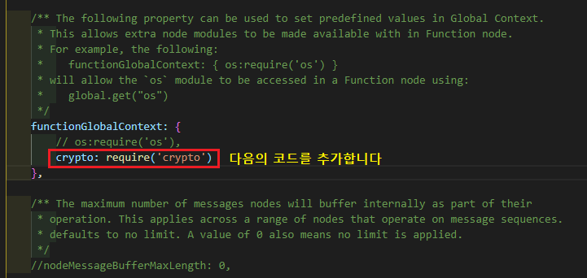

# NODE-RED 암호화 구현하기
이 예제에서는 단방향 암호화(SHA512)의 내용만 다루고 있습니다

## 확장 팔레트 설치를 통한 암호화
- 설치한 확장 팔레트 `node-red-contrib-crypto-js-dynamic`([flows.nodered.org/node/node-red-contrib-crypto-js-dynamic](https://flows.nodered.org/node/node-red-contrib-crypto-js-dynamic))
- node-red 예제 소스[/node_red_example/source.json](./node_red_example/source.json)

## node.js crypto 모듈을 이용한 암호화

- 기본적으로 node-red는 node.js 위에서 실행되며 node.js의 대부분의 기능들을 사용할 수 있습니다  
- 실제 현업에서는 salt를 이용한 암호화를 쓰기 때문에 아래의 내용은 salt를 이용한 암호화 방식입니다  
기본적인 암호화 방식은 `node-red 예제 소스`[/node_red_example/source.json](./node_red_example/source.json)를 확인하시면 됩니다  

1. node를 이용한 암호화 코드 실행하기
    - 실행할 index.js 파일을 생성합니다
    - 아래의 예시 코드를 index.js에 작성합니다
      ```js
      const crypto = require('crypto');

      const pass = 'password';

      crypto.randomBytes(64, (err, buf) => {
        const salt = buf.toString('base64');

        /* crypto.pbkdf2 함수 파라미터 */
        // 비밀번호, salt, 반복 횟수, 비밀번호 길이, 해시 알고리즘
        crypto.pbkdf2(pass, salt, 100000, 64, 'sha512', (err, key) => {
          console.log(`salt: ${salt}`);
          console.log(`key: ${key.toString('base64')}`);
        });
      });
      ```
    - index.js 파일이 있는 폴더 경로로 이동한 후 cmd 창을 이용해 다음의 명령어를 실행합니다
    - node .\index.js  
    

2. node-red에서 crypto 모듈을 사용하기
    - `C:\Users\윈도우계정\.node-red\settings.js` 파일을 아래의 이미지를 참고하여 수정합니다  
    
    - 이제 node-red에서 crypto 모듈의 기능을 function 노드를 통해 코드 작성이 가능합니다
      ```js
      const crypto = global.get('crypto');
      ```
    - node-red 예제 소스[/node_red_example/source.json](./node_red_example/source.json)